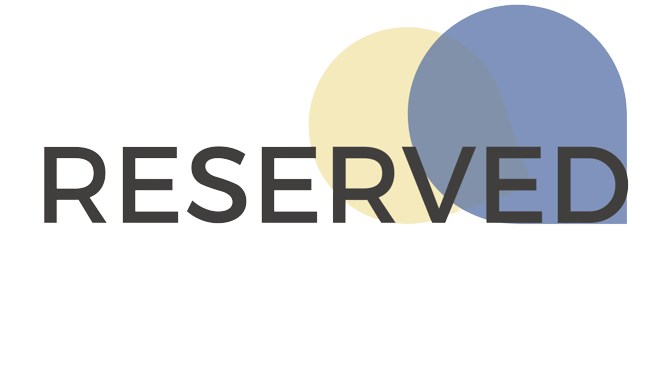

# REVERSED

## Description

We have friends tested positive for covid after going to University and cinema because the booking system did not block the seats around them.

We all want to go out during Covid period, but we are afraid of getting infected. Many people procrastinate a lot and not feeling motivated working at home with their bed just one feet away from their working table.

How can we make sure that we can work at an office space but keeping social distance at the same time to prevent ourselves from getting infected by coronavirus? We have the solution!

## Table of Contents (Optional)

If your README is long, add a table of contents to make it easy for users to find what they need.

- [Installation](#installation)
- [Usage](#usage)
- [Features](#features)
- [Team](#our-group-memebers)

## Installation

1. Download the code
2. in the root directory type `npm install`
3. go to my-app directory type `npm install` again
4. open a new terminal window, go to this project's root directory and type `node server.js`

5. back to the original terminal window, goto my-app directory and type `npm start`.

## Usage

Our booking system automatically disable seats around the selected seat(s), keeping at least 1.5m away from people around you.

This system can be applied to many areas, from University, office to cinema and flight.

Users are allowed to use Augmented Reality (AR) to check which seat is available or use this technology to navigate their way in the cinema where there’s no light! Even if there’s no any disease, we can still adapt our system for normal daily use!

We believe that this system can help to keep us safe and healthy, and benefits our social life.

## Features

1. Booking system

2. QR Code

3. AR

## Our Group Memebers

[Kayley](https://github.com/lovelymoon3)

[Wendy](https://github.com/Ziqi222)

[Sim](https://github.com/raymondsim)

[Gary](https://github.com/GaryChen513)

[Dong](https://github.com/a1779748)

